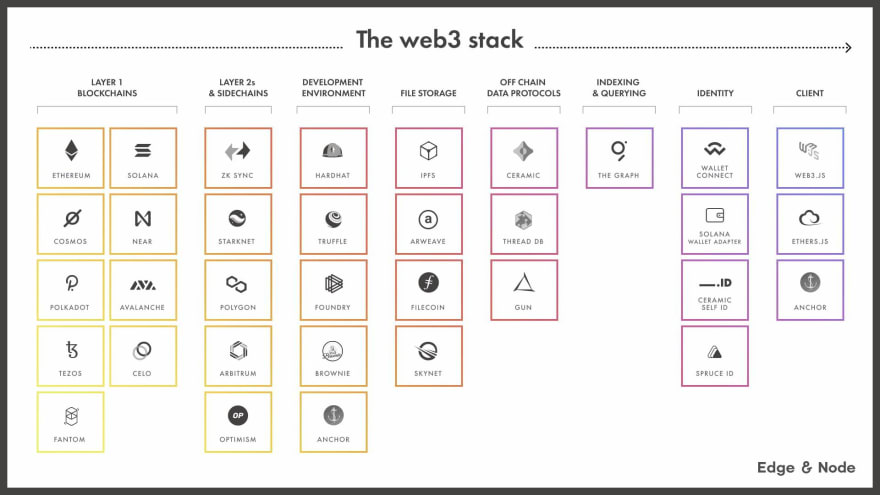

# Web3-Learning

## What is Web3
> Web3 的核心是通过区块链、加密货币和非同质化代币将权力以所有权的形式归还用户
1. web3是去中心化的
2. web3无需许可
3. web3具有原生支付功能（金融属性）
4. web3无需信任

## Technologies and resources
1. Read the Ethereum docs
2. Read the Solidity documentation
3. Get comfortable with the Remix IDE
4. Try building out a full stack dapp

## Project structure
- [blog](./blog/README.md) The project we'll be building is a full stack blog as well as a CMS
- [zombie](./zombie/README.md) Solidity 相关的语法知识
- [architecture](./architecture/README.md) The Architecture of a Web 3.0 application
- [Uright](./uright/README.md) 音乐版权管理的DApp
