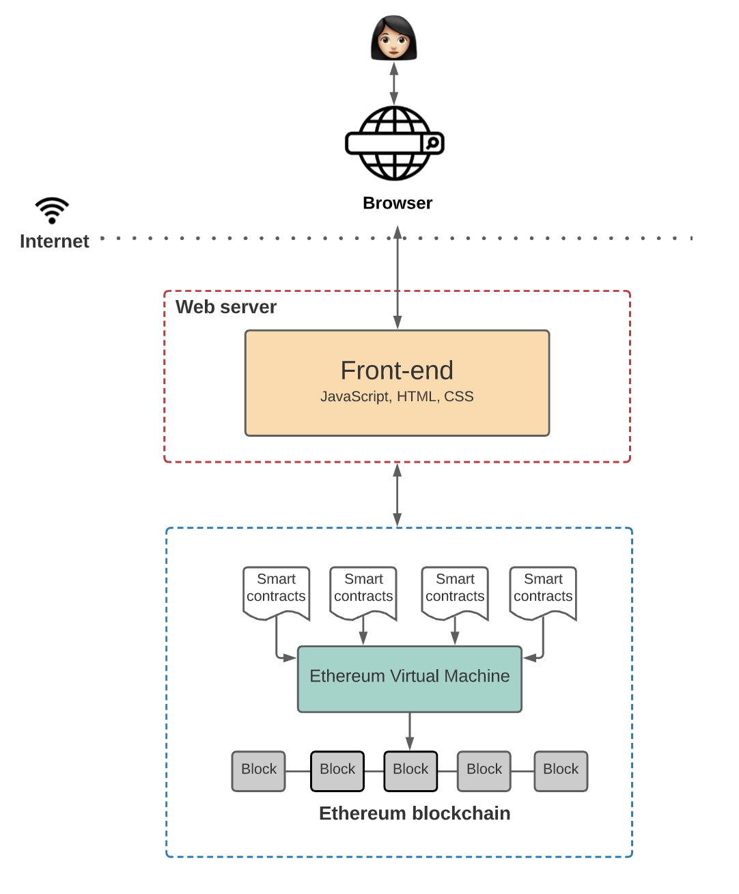
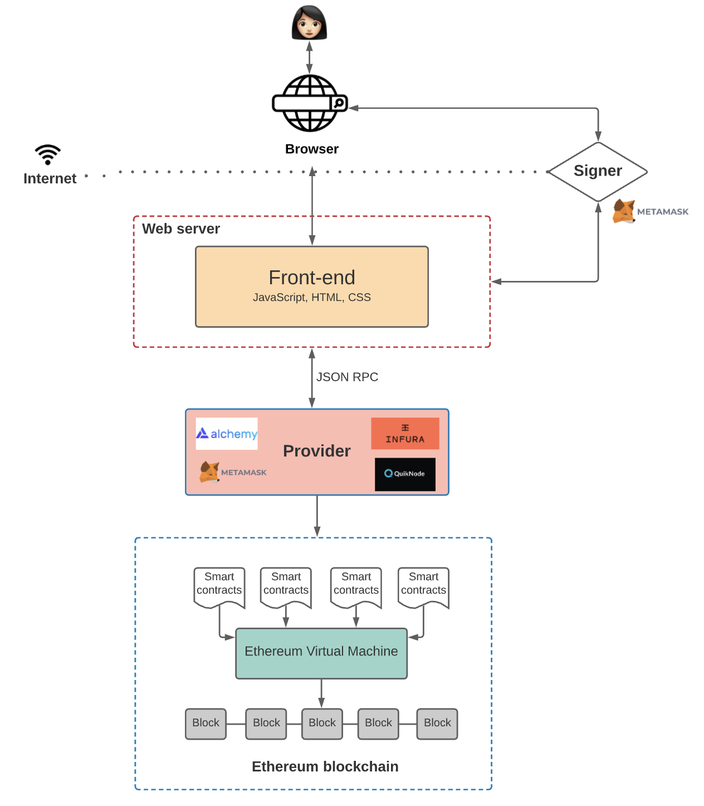
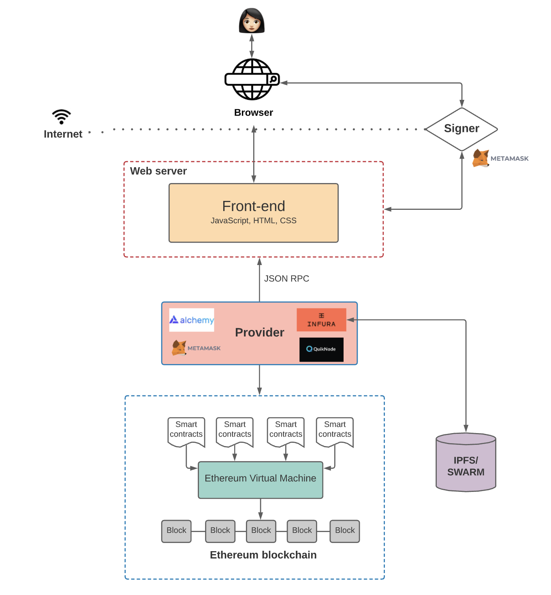
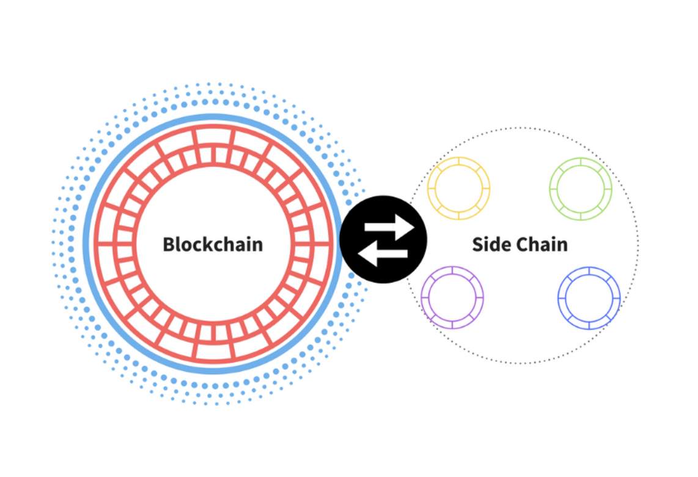

# DAPP Architecture

## What makes Web 3.0 different?

不需要集中式的服务器，也没有集中式的数据库，在匿名节点维护的分布式**状态机**上构建应用程序。

## ‍A Closer Look

### Blockchain

> The Ethereum blockchain is often touted as a “world computer.”

ETH就是个超级计算机，一个可全局访问的状态机，对等节点网络维护，全世界各地的人都有权写入，因此它被任何一个人所控制，**collectively by everyone in the network.**

### Smart contracts

> A smart contract is a program that runs on the Ethereum blockchain and defines the logic behind the state changes happening on the blockchain

智能合约是个程序且运行在以太坊链上，它的逻辑是程序在区块链上的状态变化。
任何人都可以在网络上查看智能合约的代码。

### Ethereum Virtual Machine (EVM)

将高级语言编译成字节码再执行，例如：`Solidity` and `Vyper`

### Front-end

> it defines the UI logic, but the frontend also communicates with the application logic defined in smart contracts

## How Does the Frontend Code Communicate with Smart Contracts？

> Every Ethereum client (i.e. provider) implements a JSON-RPC specification.

> Once you connect to the blockchain through a provider, you can read the state stored on the blockchain. But if you want to write to the state, there’s still one more thing you need to do before you can submit the transaction to the blockchain— “sign” the transaction using your private key.

如果你想改变链上的数据状态，需要使用你的私钥进行签署这次“交易”

在链上读取数据不需要用户签名

>💡 This “signing” of transactions is where [Metamask](https://metamask.io/) typically comes in.

**Metamask**将用户的私钥存储在浏览器，每当前端需要用户签名就会唤起**Metamask**

## ****Storage on the Blockchain****

>  Keep in mind that, with Ethereum, the user pays every time they add new data to the blockchain

One way to combat this is to use a decentralized off-chain storage solution, like [IPFS](https://ipfs.io/) or [Swarm](https://www.ethswarm.org/)

### IPFS

**IPFS**是一个用于存储和访问的分布式文件系统。

`Fiflecoin` **IPFS**的激励层，它作用在于激励世界各地的节点去存储和检索数据，它主要提供两种服务

- `Infura` 成为**IPFS**的**provider**，接入到**IPFS**的节点
- `Pinata` 使用**IPFS**存储到blockchain上并获取**IPFS**的文件哈希

我们也可以将**Frontend code** 由**IPFS** or **Swarm**上托管

## ****‍Querying the Blockchain****

### **Smart Contract Events**

你可以使用`Web3.js`library 查询和监听智能合约的事件，也可以在特定的事件时触发设置回调。前端代码可以监听智能合约触发的事件并自定义功能。

### The Graph

[The Graph](https://thegraph.com/en/) 是一种链下索引解决方案，可以轻松查询以太坊链上的数据。**The Graph** 允许你定义要索引的智能合约，监听哪些事件和函数调用，以及如何将传入事件融入到你的前端的代码里。

> By indexing blockchain data, The Graph lets us query on-chain data in our application logic with low latency
> 

## Scaling Your DApp

**Polygon** has `sidechains` that process and execute transactions.

**Polygon**是一种`sidechain`，每隔一段时间`sidechain`会聚合最近的区块并同步到`primary chain`。

关于更多的以太坊扩容，请参考：

[扩容 | ethereum.org](https://ethereum.org/zh/developers/docs/scaling/)

> We batch transactions off-chain using a “rollup” smart contract and then periodically commit these transactions to the main chain. 

The take-home idea is this: L2 解决方式是在链下执行交易，只有交易的数据存储在链上，这使得链更具有扩展性，我们不必在链上执行每一笔交易，这样做会使交易变得更快和成本更低，在必要的时候，它们仍然可以与主链进行通信。