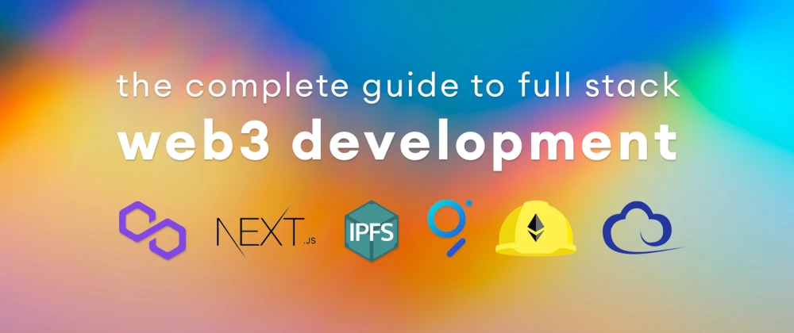
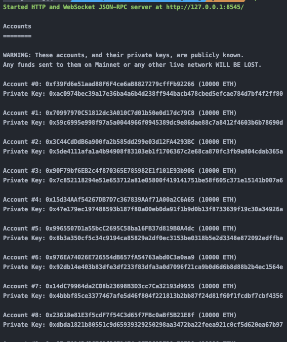
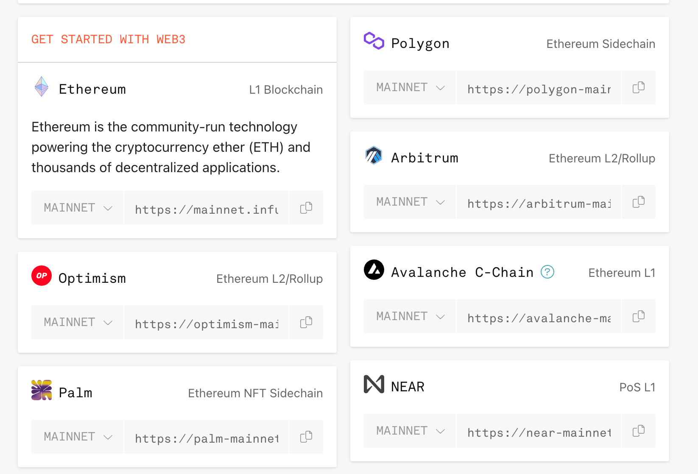

# Complete Web3 Development



## 0x01技术栈
1. Blockchain - [Polygon](https://polygon.technology/) (with optional RPC provider)
2. `Ethereum` development environment - [Hardhat](https://hardhat.org/)
3. Front end framework - [Next.js](https://nextjs.org/) & [React](https://reactjs.org/)
4. `Ethereum` web client library - [Ethers.js](https://docs.ethers.io/v5/)
5. File storage - [IPFS](https://ipfs.io/)
6. Indexing and querying - [The Graph Protocol](https://thegraph.com/en/)

## 0x02准备工作
1. `Node.js`installed on your local machine
2. `MetaMask`Chrome extension installed in your browser

## 0x03搭建项目
**install all of the necessary dependencies, and configure the project.**

```bash
npm install ethers hardhat @nomiclabs/hardhat-waffle \
ethereum-waffle chai @nomiclabs/hardhat-ethers \
web3modal @walletconnect/web3-provider \
easymde react-markdown react-simplemde-editor \
ipfs-http-client @emotion/css @openzeppelin/contracts
```

**create a new Next.js app**

```bash
npx create-next-app blog  
cd blog
```

**initialize the local smart contract development environment**

```bash
npx hardhat
```

**update the hardhat configuration at hardhat.config.js**

```jsx
require("@nomiclabs/hardhat-waffle");

module.exports = {
  solidity: "0.8.4",
  networks: {
    hardhat: {
      chainId: 1337
    },
    // mumbai: {
    //   url: "https://rpc-mumbai.matic.today",
    //   accounts: [process.env.pk]
    // },
    // polygon: {
    //   url: "https://polygon-rpc.com/",
    //   accounts: [process.env.pk]
    // }
  }
};
```

**run the test**

```bash
npx hardhat test
```

## 0x04部署合约

**To start the local network**
```bash
npx hardhat node
```

可以看到，终端输出了很多测试账号的钱包地址和私钥



**Importing the test account into your wallet**

一共有20个测试账号，每个账号持有**10,000**个fake eth，选中(**Account#0**)的账号私钥导入到你的小狐狸钱包，这是`contract`的部署账号同时也是`contract`的**owner**

## 0x05Next.jsApp

create new file named .`env.local` ****in the root project

```
ENVIRONMENT="local"
NEXT_PUBLIC_ENVIRONMENT="local"
```

这将允许客户端应用服务端的配置，关于Next.js更多的配置，请参考[here](https://nextjs.org/docs/basic-features/environment-variables)

### Before

- **[Context.js](https://reactjs.org/docs/context.html):** Context will give us an easy way to share state throughout the app.
- **[dynaimc routes](https://nextjs.org/docs/routing/dynamic-routes)**
- [getStaticPaths](https://nextjs.org/docs/basic-features/data-fetching/get-static-paths) and [getStaticProps](https://nextjs.org/docs/basic-features/data-fetching/get-static-props)

### Testing it out

**Open a new terminal window and start the Next.js app:**

```bash
npm run dev
```

## 0x06Mumbai网络

We'll start by deploying to **Mumbai**, the Polygon test network

>💡 千万不要将你的私钥推送到你的源代码仓库中

**export your private key**

```bash
export pk="your-private-key"
```

### **Add Network**

- Network Name: **Mumbai TestNet**
- New RPC URL: **[https://rpc-mumbai.matic.today](https://rpc-mumbai.matic.today/)**
- Chain ID: **80001**
- Currency Symbol: **Matic**
- 领取测试代币: [Polygon Faucet](https://faucet.polygon.technology/)

### **Deploying to the Polygon network**

uncomment the **mumbai** configuration in `hardhat.config.js`
**To deploy to Polygon testnet, run the following command:**
```bash
npx hardhat run scripts/deploy.js --network mumbai
```

> 运行上面命令出现 `ProviderError: RPCError`错误，public RPC 可能因为网络问题连接不上，建议使用第三方RPC，like [infura](https://www.infura.io/zh)
> 


**Next, restart the server to register the change in environment variables:**

```bash
npm run dev
```

## 0x07 **Creating a subgraph API**
>💡 To be continued