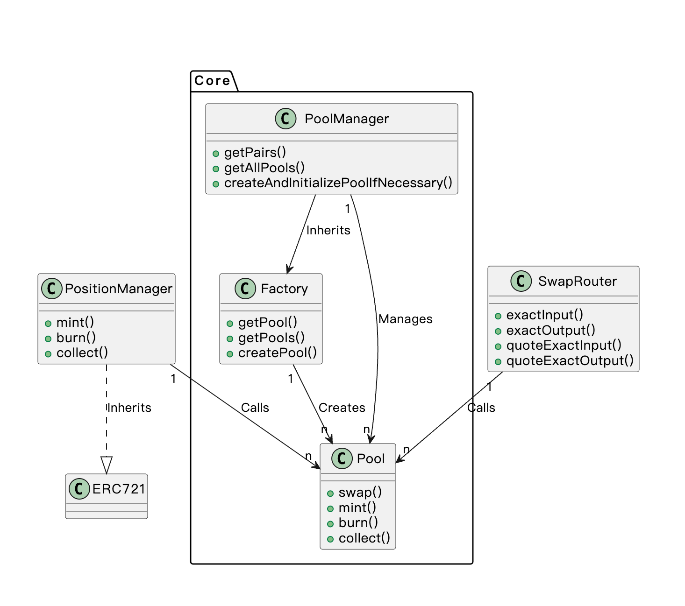

# SWAP contracts structure

以简单为原则，我们不按照 Uniswap V3 将合约分为 `periphery` 和 `core` 两个独立仓库，而是自顶向下分为以下四个合约。

- `PoolManager.sol`: 顶层合约，对应 Pool 页面，负责 Pool 的创建和管理。
- `PositionManager.sol`: 顶层合约，对应 Position 页面，负责 LP 头寸和流动性的管理。
- `SwapRouter.sol`: 顶层合约，对应 Swap 页面，负责预估价格和交易。
- `Factory.sol`: 底层合约，Pool 的工厂合约；
- `Pool.sol`: 最底层合约，对应一个交易池，记录了当前价格、头寸、流动性等信息。

下面是合约的 UML 图：



## Contract details

### Factory.sol

`Factory.sol` 是 Pool 的工厂合约，比较简单，定义了 `getPool` 和 `createPool` 的方法，以及 `PoolCreated` 事件。

`IFactory` 接口定义如下：

```solidity
event PoolCreated(
    address indexed token0,
    address indexed token1,
    uint32 indexed index,
    address pool
);

function getPool(
    address token0,
    address token1,
    uint32 index
) external view returns (address pool);

function createPool(
    address token0,
    address token1,
    int24 tickLower,
    int24 tickUpper,
    uint24 fee
) external returns (address pool);
```

特别的，参照 Uniswap，工厂合约也设计成临时存储交易池合约初始化参数`parameters`，从而完成参数的传递。新增如下方法定义：

```solidity
function parameters()
    external
    view
    returns (
        address factory,
        address token0,
        address token1,
        int24 tickLower,
        int24 tickUpper,
        uint24 fee
    );
```

#### createPool

```solidity
parameters = Parameters(address(this), token0, token1, tickLower, tickUpper, fee);
bytes32 salt = keccak256(abi.encode(token0, token1, tickLower, tickUpper, fee));
pool = address(new Pool{ salt: salt }());
delete parameters;
```

这是经典的 "临时存储参数 → CREATE2 部署 → 清理" 三步模式。`parameters` 是临时写入、Pool 构造函数读取、然后立即删除的。任何人都可以根据 (token0, token1, tickLower, tickUpper, fee) 算出 Pool 地址。

而在我们的代码中 `salt` 是通过 `abi.encode(token0, token1, tickLower, tickUpper, fee)` 计算出来的，这样的好处是只要我们知道了 `token0` 和 `token1` 的地址，以及 `tickLower`、`tickUpper` 和 `fee` 这三个参数，我们就可以预测出来新合约的地址。在实际的 DeFi 场景中，这样会带来很多好处。比如其他合约可以直接计算出我们 `Pool` 合约的地址，这样可以开发出和 `Pool` 合约交互的更多的功能。

### PoolManager.sol

`PoolManager.sol` 是 Pool 的管理合约，负责 Pool 的创建和管理。 它提供了一个 `getAllPools` 的方法，可以获取所有池子的基本信息，返回值是一个 `PoolInfo` 结构体数组。

```solidity
struct PoolInfo {
    address token0;
    address token1;
    uint32 index;
    int24 fee;
    int24 tickLower;
    int24 tickUpper;
    int24 tick;
    uint160 sqrtPriceX96;
    uint128 liquidity;
}
function getAllPools() external view returns (PoolInfo[] memory poolsInfo);
```

每个 pool 的信息包括：

- token0 和 token1 的地址；
- 费率;
- 价格范围；
- 当前价格；
- 流动性。

此外还有一个添加池子的操作，当添加头寸时如果发现还没有对应的池子，需要先创建一个池子。
`PoolManager` 直接继承了 `Factory`（交易池的工厂合约），而不是通过合约调用来调用 `Factory`，所有交易池的创建都需要经过 `PoolManager`。你可以理解为 `PoolManager` 就是一个加强版的 `Factory` 合约。

### Pool.sol

🫀 交易池的心脏

**核心设计：简化版 Uniswap V3 集中流动性**

与 Uniswap V3 的关键区别：每个 Pool 只有**一个固定价格区间** `[tickLower, tickUpper]`，没有 tick bitmap，不需要跨 tick 逻辑。这是一个重大简化。

Pool 不通过构造函数传参，而是从 Factory 的临时变量读取。原因：CREATE2 地址计算公式是 `hash(0xFF, sender, salt, bytecode)`，如果构造函数带参数，参数会改变 bytecode（实际是 initcode），导致无法从外部预算出 Pool 地址。

#### Mint （添加流动性）

1. 调用 `_modifyPosition` 计算需要的 amount0/amount1
2. 结算历史手续费（`feeGrowthGlobal - feeGrowthInsideLast`）× liquidity
3. 记录余额快照 `balance0Before`
4. **回调** `IMintCallback(msg.sender).mintCallback(amount0, amount1, data)` — 让调用者转入 token
5. 验证 `balance0Before + amount0 <= balance0()` — 确认钱到账

**一句话理解**: 

```text
Pool.mint() = 计算新增 liquidity 需要多少 token + 结算旧手续费 + 更新 position + callback 收款 + 校验到账
```

具体解析可参考 [Mint流程解析](notes/Pool_Mint.md)。

#### Burn （减少流动性）

#### Collect （收取手续费）
