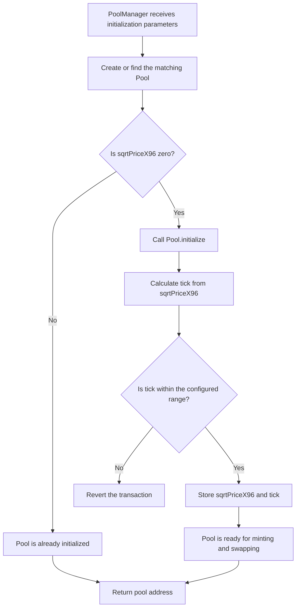

# Diving into `PoolManager` contract

## 1. What is the relationship between `PoolManager` and `Pool`?

You can think of the two contracts like this:

- `PoolManager`: the **pool creation and initialization entry point**
- `Pool`: the **actual AMM pool instance** that holds runtime state

### What `PoolManager` does

`PoolManager` inherits from `Factory`, so it has the ability to create pools. Its main responsibilities are:

1. Create a pool
2. Initialize the pool's starting price
3. Maintain the list of token pairs
4. Expose aggregated(totaled) read functions such as `getAllPools()`

It does **not** implement the core AMM runtime logic such as `swap`, `mint`, or `burn` math.

### What `Pool` does

`Pool` is the contract that actually runs the AMM. It stores and updates:

- `token0` / `token1`
- `sqrtPriceX96`
- `tick`
- `liquidity`
- fee growth variables
- position balances and swap state

It implements the core actions:

- `mint`
- `burn`
- `collect`
- `swap`

In one sentence:

> `PoolManager` is responsible for creating and initializing pools, while `Pool` is responsible for the actual ongoing pool behavior.

## 2. Why can `PoolManager` create `Pool`?

Because `PoolManager` inherits from `Factory`:

```solidity
contract PoolManager is Factory, IPoolManager
```

And `Factory` defines:

```solidity
function createPool(...)
```

So the external flow is:

- `PoolManager.createAndInitializePoolIfNecessary()` is the user-facing entry
- it internally calls the inherited `createPool()`
- `createPool()` deploys a new `Pool` through `CREATE2`

## 3. How does `Pool` receive its constructor parameters?

This is one of the more elegant parts of the design.

Inside `Factory.createPool()`:

```solidity
parameters = Parameters(address(this), token0, token1, tickLower, tickUpper, fee);
pool = address(new Pool{ salt: salt }());
delete parameters;
```

Inside the `Pool` constructor:

```solidity
(factory, token0, token1, tickLower, tickUpper, fee) = IFactory(msg.sender).parameters();
```

So the deployment flow is:

1. `Factory` / `PoolManager` temporarily writes the pool parameters into `parameters`
2. it deploys a new `Pool`
3. the `Pool` constructor reads those parameters back from `msg.sender`
4. the factory deletes the temporary data

### Why not pass constructor arguments directly?

Because this project uses `CREATE2`, and the author wants the resulting pool address to be deterministic.

If constructor arguments were directly embedded into the init code, they would affect the address calculation. By using:

> temporary parameter storage + constructor pull-back

The deployment remains deterministic while still allowing the pool to receive its initialization parameters.

## 4. If I want to create a pair of tokens, what is the execution flow?

Strictly speaking, the system is not only creating a generic token pair. It is creating:

> a specific pool for two tokens under a particular `(tickLower, tickUpper, fee)` configuration

That means the same token pair can have multiple pools.

## 5. External entry: `createAndInitializePoolIfNecessary`

The entry point is:

```solidity
function createAndInitializePoolIfNecessary(CreateAndInitializeParams calldata params)
    external
    payable
    override
    returns (address poolAddress)
```

The input includes:

- `token0`
- `token1`
- `fee`
- `tickLower`
- `tickUpper`
- `sqrtPriceX96`

So creating a pool requires not only the token pair, but also:

- the fee tier
- the active price range
- the initial starting price

## 6. Step-by-step execution flow

### Step 1: Validate token ordering

```solidity
require(params.token0 < params.token1, "token0 must be less than token1");
```

This ensures a canonical token ordering so that:

- `A/B` and `B/A` are not treated as different pairs
- storage keys remain consistent

### Step 2: Call `createPool`

```solidity
poolAddress = this.createPool(params.token0, params.token1, params.tickLower, params.tickUpper, params.fee);
```

Execution now enters `Factory.createPool()`.

### Step 3: `Factory.createPool()` sorts tokens again

Even though `PoolManager` already checks ordering, `Factory` defensively sorts the tokens again:

```solidity
(token0, token1) = sortToken(tokenA, tokenB);
```

This is a second layer of protection.

### Step 4: Check whether the pool already exists

The factory first reads:

```solidity
address[] memory existingPools = pools[token0][token1];
```

Then it scans all existing pools for the same pair and checks whether one already matches:

```solidity
if (
    currentPool.tickLower() == tickLower &&
    currentPool.tickUpper() == tickUpper &&
    currentPool.fee() == fee
) {
    return existingPools[i];
}
```

So for a given token pair:

- different fee tiers can create different pools
- different tick ranges can create different pools
- only the exact same `(tickLower, tickUpper, fee)` is considered the same pool

### Step 5: Write temporary deployment parameters

```solidity
parameters = Parameters(address(this), token0, token1, tickLower, tickUpper, fee);
```

These values will be consumed by the new `Pool` constructor.

### Step 6: Build the `CREATE2` salt

```solidity
bytes32 salt = keccak256(abi.encode(token0, token1, tickLower, tickUpper, fee));
```

This makes the deployed pool address deterministic for that exact pool definition.

### Step 7: Deploy the new `Pool`

```solidity
pool = address(new Pool{ salt: salt }());
```

This triggers the `Pool` constructor:

```solidity
(factory, token0, token1, tickLower, tickUpper, fee) = IFactory(msg.sender).parameters();
```

At this point, the new pool learns:

- factory address
- token0
- token1
- tickLower
- tickUpper
- fee

However, the pool is **still not initialized**. At this stage:

- `sqrtPriceX96 == 0`
- `tick` is not active yet
- the pool cannot be used normally for minting or swapping

### Step 8: Record the pool in the factory mapping

```solidity
pools[token0][token1].push(pool);
```

Now the pool becomes discoverable under that token pair.

### Step 9: Clear temporary parameters

```solidity
delete parameters;
```

This prevents stale deployment data from being reused incorrectly.

### Step 10: Return to `PoolManager` and load the pool

```solidity
IPool pool = IPool(poolAddress);
```

### Step 11: Initialize the pool price

```solidity
if (pool.sqrtPriceX96() == 0) {
    pool.initialize(params.sqrtPriceX96);
}
```

After deployment, the pool exists and has its configuration—token0, token1, tick range, and fee—but it still has no valid market price:

```solidity
sqrtPriceX96 == 0
tick == 0 // only a default value
```

This is the key activation step.

Inside `Pool.initialize()`:

```solidity
require(sqrtPriceX96 == 0, "INITIALIZED");
tick = TickMath.getTickAtSqrtPrice(sqrtPriceX96_);
require(tick >= tickLower && tick < tickUpper, ...);
sqrtPriceX96 = sqrtPriceX96_;
```

That means:

1. initialization can happen only once
2. the pool computes the current `tick` from `sqrtPriceX96`
3. the computed tick must lie inside the configured range
4. the initial price is persisted into pool state

** Only after this step is the pool truly usable. **

> The pool contract exists after deployment, but it can only operate normally—accepting liquidity and executing swaps—after its initial price and corresponding tick have been set


### Step 12: If this is the first pool for the pair, record the pair

```solidity
if (index == 1) {
    pairs.push(Pair({ token0: pool.token0(), token1: pool.token1() }));
}
```

The intent here is:

- `pools[token0][token1].length == 1`
- meaning this is the first pool for this token pair
- so the pair should be added into `pairs[]`

That later enables functions such as:

- `getPairs()`
- `getAllPools()`

## 7. What happens after the pool is created?

After creation:

- `PoolManager` is mainly used for discovery and lifecycle entry points
- `Pool` handles the real runtime logic
- `PositionManager` later calls `pool.mint(...)` to add liquidity
- `SwapRouter` later calls `pool.swap(...)` to execute trades

So the architecture is layered like this:

- `PoolManager`: create pools
- `Pool`: runtime AMM engine
- `PositionManager`: liquidity provider entry point
- `SwapRouter`: swap execution entry point

## 8. One-sentence summary

> A caller invokes `PoolManager.createAndInitializePoolIfNecessary()`, which internally uses the inherited `Factory.createPool()` to deploy a deterministic `Pool` via `CREATE2`; the new `Pool` reads its constructor parameters back from factory storage, then `PoolManager` initializes its starting price through `initialize()`, and finally the token pair is registered for later discovery.

## 9. the Process Flowchart

