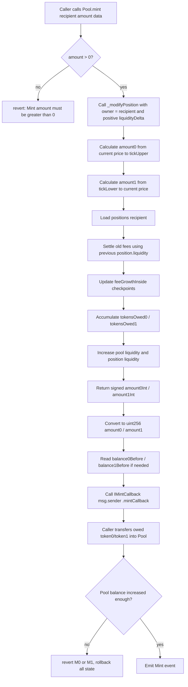

# Diving into `Pool.mint`

`Pool.mint()` is the entry point for adding liquidity into one concrete pool.

In this project, a `Pool` is already bound to:

- one token pair: `token0` / `token1`
- one fee tier: `fee`
- one fixed price range: `[tickLower, tickUpper)`

So minting does not choose a new range. The range has already been decided when the pool was created by `PoolManager` / `Factory`.

In one sentence:

> `mint` increases liquidity for an owner inside the pool's fixed range, calculates how many tokens must be paid in, settles old fees first, then uses a callback to collect the required token0/token1 from the caller.

## 1. Where does `mint` sit in the whole flow?

The simplified architecture is:

```text
user / periphery contract
        |
        v
Pool.mint(recipient, amount, data)
        |
        v
Pool._modifyPosition(...)
        |
        v
IMintCallback(msg.sender).mintCallback(...)
        |
        v
caller transfers token0/token1 into Pool
```

There are two important addresses here:

- `recipient`: the owner whose `positions[recipient]` will be updated.
- `msg.sender`: the contract/account that calls `Pool.mint()` and must implement `mintCallback`.

These two addresses do not have to be the same.

For example, if a `PositionManager` exists above the pool, the flow usually looks like:

```text
user -> PositionManager.mint(...) -> Pool.mint(user, liquidity, callbackData)
```

In that case:

- `recipient == user`
- `msg.sender == PositionManager`
- the pool calls `PositionManager.mintCallback(...)`
- `PositionManager` is responsible for pulling/transferring the tokens into the pool

This repo currently defines `IPositionManager`, but the core behavior being studied here is inside `Pool.sol`.

## 2. The external interface

```solidity
function mint(
    address recipient,
    uint128 amount,
    bytes calldata data
)
    external
    override
    returns (uint256 amount0, uint256 amount1)
```

The parameters mean:

- `recipient`: who owns the liquidity position in this pool.
- `amount`: how much liquidity to add.
- `data`: opaque callback data, passed back to `msg.sender` during `mintCallback`.

The return values mean:

- `amount0`: how much `token0` must be paid into the pool.
- `amount1`: how much `token1` must be paid into the pool.

Notice what is not here:

- no slippage limit
- no deadline
- no `amount0Max` / `amount1Max`
- no ERC20 `transferFrom` directly inside `Pool.mint`

Those protections belong in the caller/periphery layer. `Pool` only enforces that the required tokens have arrived by the end of the callback.

## 3. Precondition: the pool must already be initialized

`Pool.mint()` itself does not explicitly check:

```solidity
sqrtPriceX96 != 0
```

But `_modifyPosition()` immediately uses `sqrtPriceX96` in `SqrtPriceMath.getAmount0Delta(...)`.

If the pool has not been initialized, `sqrtPriceX96 == 0`, and the math will fail because the lower sqrt price used in amount0 calculation cannot be zero.

So the real lifecycle is:

```text
create pool
  -> initialize pool price
  -> mint liquidity
  -> swap / burn / collect
```

This matches the `PoolManager.createAndInitializePoolIfNecessary(...)` flow: the pool is deployed first, then `Pool.initialize(sqrtPriceX96)` activates the price.

## 4. Step-by-step execution flow

### Step 1: reject zero liquidity

```solidity
require(amount > 0, "Mint amount must be greater than 0");
```

Minting zero liquidity is rejected immediately.

### Step 2: call `_modifyPosition`

```solidity
(int256 amount0Int, int256 amount1Int) =
    _modifyPosition(ModifyPositionParams({
        owner: recipient,
        liquidityDelta: int128(amount)
    }));
```

This is the core state transition.

`amount` is converted into a positive `liquidityDelta`, meaning:

> add this much liquidity to `recipient`'s position.

The pool stores positions like this:

```solidity
mapping(address => Position) public positions;
```

Because each pool has only one fixed `[tickLower, tickUpper)` range, the position key only needs the owner address. This is simpler than Uniswap V3, where a position is keyed by owner + lower tick + upper tick.

### Step 3: calculate token0/token1 required for the new liquidity

Inside `_modifyPosition`:

```solidity
amount0 =
    SqrtPriceMath.getAmount0Delta(
        sqrtPriceX96,
        TickMath.getSqrtPriceAtTick(tickUpper),
        params.liquidityDelta
    );

amount1 =
    SqrtPriceMath.getAmount1Delta(
        TickMath.getSqrtPriceAtTick(tickLower),
        sqrtPriceX96,
        params.liquidityDelta
    );
```

The current price is between the pool's lower and upper price:

```text
sqrtPriceLower <= sqrtPriceX96 < sqrtPriceUpper
```

So when adding liquidity:

- `amount0` covers the part from current price up to upper price.
- `amount1` covers the part from lower price up to current price.

Conceptually:

```text
lower price                  current price                 upper price
|----------------------------|-----------------------------|
        token1 side                      token0 side
```

The formulas are the standard concentrated-liquidity formulas:

```text
amount0 = liquidity * (sqrtUpper - sqrtCurrent) / (sqrtUpper * sqrtCurrent)
amount1 = liquidity * (sqrtCurrent - sqrtLower)
```

The Solidity implementation uses Q64.96 fixed-point math and rounds up for positive liquidity deltas, so the pool asks for enough tokens to fully back the new liquidity.

### Step 4: settle old fees before changing liquidity

Still inside `_modifyPosition`:

```solidity
Position storage position = positions[params.owner];

uint128 tokensOwed0 = uint128(
    FullMath.mulDiv(
        feeGrowthGlobal0X128 - position.feeGrowthInside0LastX128,
        position.liquidity,
        FixedPoint128.Q128
    )
);

uint128 tokensOwed1 = uint128(
    FullMath.mulDiv(
        feeGrowthGlobal1X128 - position.feeGrowthInside1LastX128,
        position.liquidity,
        FixedPoint128.Q128
    )
);
```

This part is easy to miss.

Before adding new liquidity, the pool first settles the fees earned by the old liquidity.

The idea is:

```text
new fees owed = fee growth since last update * old liquidity
```

Then the checkpoint is updated:

```solidity
position.feeGrowthInside0LastX128 = feeGrowthGlobal0X128;
position.feeGrowthInside1LastX128 = feeGrowthGlobal1X128;
```

And the calculated fees are accumulated into:

```solidity
position.tokensOwed0
position.tokensOwed1
```

This means newly added liquidity does not receive historical fees. It only starts earning fees after the mint checkpoint.

### Step 5: update pool liquidity and position liquidity

```solidity
liquidity = LiquidityMath.addDelta(liquidity, params.liquidityDelta);
position.liquidity = LiquidityMath.addDelta(position.liquidity, params.liquidityDelta);
```

Two values are updated:

- global pool `liquidity`
- this owner's `position.liquidity`

Because the project has one active range per pool, adding liquidity directly increases the pool's usable liquidity.

At this point, state has already been updated, but the required tokens have not been paid yet.

That is safe because if the later callback or balance check fails, the whole transaction reverts and all state changes roll back.

### Step 6: convert signed deltas into unsigned payment amounts

Back in `mint`:

```solidity
amount0 = uint256(amount0Int);
amount1 = uint256(amount1Int);
```

For minting, `liquidityDelta` is positive, so both deltas should be non-negative.

For burn, the same helper is reused with a negative `liquidityDelta`, which is why `_modifyPosition` returns signed integers.

### Step 7: record pool balances before callback

```solidity
uint256 balance0Before;
uint256 balance1Before;
if (amount0 > 0) balance0Before = balance0();
if (amount1 > 0) balance1Before = balance1();
```

The pool records its token balances before asking the caller to pay.

It only reads the balance if that token is actually owed.

### Step 8: call `mintCallback` on `msg.sender`

```solidity
IMintCallback(msg.sender).mintCallback(amount0, amount1, data);
```

This is the payment handoff.

`Pool` does not know how the caller wants to pay. It only says:

> I need `amount0` token0 and `amount1` token1. Caller, pay them now.

The caller must implement:

```solidity
function mintCallback(
    uint256 amount0Owed,
    uint256 amount1Owed,
    bytes calldata data
) external;
```

The callback commonly decodes `data` to know which tokens/payer to use, then transfers the required tokens into `msg.sender`, which is the pool from the callback's perspective.

The important direction is:

```text
callback contract -> transfers token0/token1 -> Pool
```

Not:

```text
Pool -> pulls tokens directly from user
```

### Step 9: verify payment arrived

```solidity
if (amount0 > 0) {
    require(balance0Before.add(amount0) <= balance0(), "M0");
}
if (amount1 > 0) {
    require(balance1Before.add(amount1) <= balance1(), "M1");
}
```

This is the key safety check.

The pool does not trust the callback. After callback returns, it checks its real ERC20 balances.

If token0 was owed:

```text
balance0After >= balance0Before + amount0
```

If token1 was owed:

```text
balance1After >= balance1Before + amount1
```

If either check fails, the transaction reverts with:

- `M0`: token0 payment was insufficient
- `M1`: token1 payment was insufficient

Because the transaction reverts, the earlier liquidity and fee-accounting updates are also reverted.

### Step 10: emit `Mint`

```solidity
emit Mint(msg.sender, recipient, amount, amount0, amount1);
```

The event records:

- `sender`: the direct caller of `Pool.mint`
- `owner`: the recipient whose position was increased
- `amount`: liquidity added
- `amount0`: token0 paid
- `amount1`: token1 paid

This event is what an indexer can use to track liquidity additions at the pool level.

## 5. Full flowchart



## 6. What state changes during mint?

The state transitions are:

| State | Change |
| --- | --- |
| `liquidity` | increases by `amount` |
| `positions[recipient].liquidity` | increases by `amount` |
| `positions[recipient].feeGrowthInside0LastX128` | updates to current `feeGrowthGlobal0X128` |
| `positions[recipient].feeGrowthInside1LastX128` | updates to current `feeGrowthGlobal1X128` |
| `positions[recipient].tokensOwed0` | increases by previously earned token0 fees, if any |
| `positions[recipient].tokensOwed1` | increases by previously earned token1 fees, if any |
| Pool token balances | increase by `amount0` and/or `amount1` after callback |

The pool price does not change during mint:

- `sqrtPriceX96` is unchanged.
- `tick` is unchanged.

Adding liquidity deepens the pool at the current price. It does not execute a swap.

## 7. Why update liquidity before receiving tokens?

This is the standard optimistic callback pattern.

The pool first calculates and records the intended liquidity change, then calls back to the caller to collect payment.

This works because Ethereum transactions are atomic:

- if the callback pays enough, the mint succeeds
- if the callback does not pay enough, the balance check fails
- if the balance check fails, all previous state updates revert

So the pool can safely write state before the external callback, as long as it verifies final balances before returning.

## 8. Important design notes

### `recipient` owns the liquidity, `msg.sender` pays through callback

`positions[recipient]` is updated, but `mintCallback` is called on `msg.sender`.

This is why a manager contract can mint on behalf of a user.

### The pool does not enforce user-level slippage

`Pool.mint()` returns the actual `amount0` and `amount1`, but it does not check whether those amounts are acceptable to the user.

If the UI or periphery wants protection, it should enforce something like:

```text
amount0 <= amount0Max
amount1 <= amount1Max
deadline not expired
```

That logic is intentionally outside the pool.

### New liquidity does not earn past fees

Fee settlement happens before liquidity is increased.

So the sequence is:

```text
settle fees on old liquidity
  -> update fee checkpoints
  -> add new liquidity
```

This prevents someone from minting right before fee collection and claiming fees generated before they provided liquidity.

### Position key is simplified

This implementation uses:

```solidity
mapping(address => Position) public positions;
```

That is possible because a pool has only one fixed range.

In full Uniswap V3, a position must include tick range in the key because the same owner can have many positions across different ranges.

### Callback data is opaque to the pool

`data` is passed through without interpretation:

```solidity
IMintCallback(msg.sender).mintCallback(amount0, amount1, data);
```

This keeps `Pool` generic. The caller decides how to encode payer/token/payment information.

The pool's only requirement is the final balance check.

## 9. Mental model

The easiest way to understand `mint` is:

```text
1. Work out how many tokens this liquidity requires.
2. Credit any old fees to the existing position.
3. Increase the pool and owner liquidity.
4. Ask the caller to pay through callback.
5. Verify the pool really received the tokens.
6. Emit the Mint event.
```

Or more compactly:

> `mint` is optimistic accounting plus callback-based payment verification.
