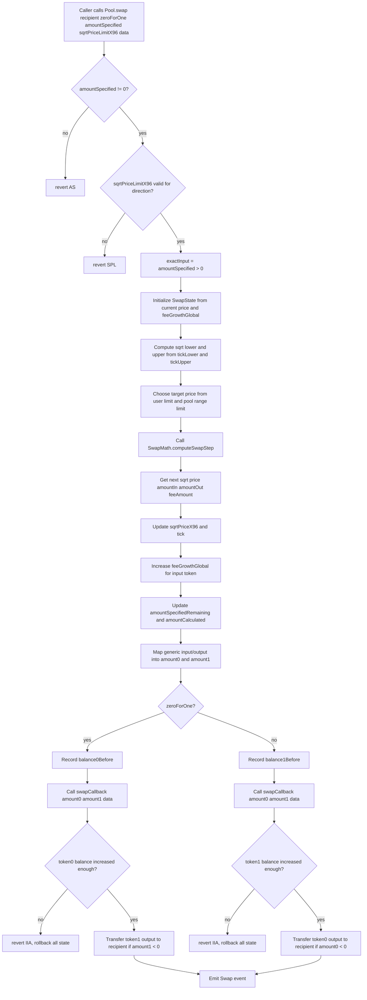

# Diving into `Pool.swap`

`Pool.swap()` is the entry point for trading against one concrete pool.

In this project, a `Pool` is already bound to:

- one token pair: `token0` / `token1`
- one fee tier: `fee`
- one fixed price range: `[tickLower, tickUpper)`

So a swap does not search across many tick ranges. It only trades inside this pool's fixed range, bounded by:

- the pool range limit
- the user-provided `sqrtPriceLimitX96`
- the available `liquidity`
- the requested input or output amount

In one sentence:

> `swap` moves the pool price inside its fixed range, calculates the actual token deltas and fee, updates global fee growth, uses a callback to collect the input token from the caller, transfers the output token to the recipient, and emits a `Swap` event.

## 1. Where does `swap` sit in the whole flow?

The simplified architecture is:

```text
user / router / periphery contract
        |
        v
Pool.swap(recipient, zeroForOne, amountSpecified, sqrtPriceLimitX96, data)
        |
        v
SwapMath.computeSwapStep(...)
        |
        v
update price / tick / feeGrowthGlobal
        |
        v
ISwapCallback(msg.sender).swapCallback(...)
        |
        v
caller transfers input token into Pool
        |
        v
Pool transfers output token to recipient
```

There are two important addresses:

- `recipient`: who receives the output token.
- `msg.sender`: the direct caller of `Pool.swap()` and the contract/account that must implement `swapCallback`.

These two addresses do not have to be the same.

For example, if a `SwapRouter` exists above the pool, the flow usually looks like:

```text
user -> SwapRouter.exactInput(...) -> Pool.swap(user, ...)
```

In that case:

- `recipient == user`
- `msg.sender == SwapRouter`
- the pool calls `SwapRouter.swapCallback(...)`
- the router is responsible for transferring the owed input token into the pool

This repo currently defines `ISwapRouter`, but the core swap behavior being studied here is inside `Pool.sol`.

## 2. The external interface

```solidity
function swap(
    address recipient,
    bool zeroForOne,
    int256 amountSpecified,
    uint160 sqrtPriceLimitX96,
    bytes calldata data
)
    external
    override
    returns (int256 amount0, int256 amount1)
```

The parameters mean:

- `recipient`: who receives the output token.
- `zeroForOne`: swap direction.
- `amountSpecified`: positive for exact input, negative for exact output.
- `sqrtPriceLimitX96`: user price limit. The swap cannot move price beyond this value.
- `data`: opaque callback data, passed back to `msg.sender` during `swapCallback`.

The return values mean:

- `amount0`: token0 delta from the pool's perspective.
- `amount1`: token1 delta from the pool's perspective.

The sign convention is important:

```text
positive amount delta: token is owed to the pool
negative amount delta: token is owed by the pool to the recipient
```

So for a normal token0 -> token1 swap:

```text
amount0 > 0   caller must pay token0 into the pool
amount1 < 0   pool pays token1 to recipient
```

Notice what is not here:

- no deadline
- no path validation
- no `amountOutMinimum`
- no `amountInMaximum`
- no user-level slippage revert except the raw `sqrtPriceLimitX96`
- no direct ERC20 `transferFrom` from the user

Those protections belong in the caller/periphery layer. `Pool` only enforces its price limit and verifies that the required input token arrived.

## 3. Direction and exact mode

There are two independent concepts:

### Direction: `zeroForOne`

```text
zeroForOne == true
  input token:  token0
  output token: token1
  price moves down

zeroForOne == false
  input token:  token1
  output token: token0
  price moves up
```

Here "price" means the pool's `sqrtPriceX96`.

### Mode: `amountSpecified`

```text
amountSpecified > 0
  exact input
  user says: spend up to this much input

amountSpecified < 0
  exact output
  user says: try to receive this much output
```

The implementation records this as:

```solidity
bool exactInput = amountSpecified > 0;
```

So there are four useful cases:

| Direction | Mode | User gives | User receives | Expected signs |
| --- | --- | --- | --- | --- |
| `zeroForOne = true` | exact input | exact token0 input | token1 output | `amount0 > 0`, `amount1 < 0` |
| `zeroForOne = true` | exact output | token0 input | exact token1 output | `amount0 > 0`, `amount1 < 0` |
| `zeroForOne = false` | exact input | exact token1 input | token0 output | `amount0 < 0`, `amount1 > 0` |
| `zeroForOne = false` | exact output | token1 input | exact token0 output | `amount0 < 0`, `amount1 > 0` |

The direction decides which token is input/output. The sign of `amountSpecified` decides whether the user fixed the input side or the output side.

## 4. Precondition: the pool must already be initialized and liquid

`Pool.swap()` does not explicitly check:

```solidity
sqrtPriceX96 != 0
liquidity > 0
```

But `SwapMath.computeSwapStep()` eventually calls `SqrtPriceMath.getNextSqrtPriceFromInput(...)` or `getNextSqrtPriceFromOutput(...)`, and those functions require:

```solidity
require(sqrtPX96 > 0);
require(liquidity > 0);
```

So the real lifecycle is:

```text
create pool
  -> initialize pool price
  -> mint liquidity
  -> swap
```

If there is no initialized price or no usable liquidity, the swap cannot proceed normally.

## 5. Step-by-step execution flow

### Step 1: reject zero amount

```solidity
require(amountSpecified != 0, "AS");
```

A swap with no input and no output is rejected immediately.

### Step 2: validate the user price limit

```solidity
require(
    zeroForOne
        ? sqrtPriceLimitX96 < sqrtPriceX96 && sqrtPriceLimitX96 > TickMath.MIN_SQRT_PRICE
        : sqrtPriceLimitX96 > sqrtPriceX96 && sqrtPriceLimitX96 < TickMath.MAX_SQRT_PRICE,
    "SPL"
);
```

The price limit must be on the correct side of the current price.

For `zeroForOne == true`:

```text
token0 in, token1 out
sqrtPriceX96 moves down
therefore sqrtPriceLimitX96 must be below current price
```

For `zeroForOne == false`:

```text
token1 in, token0 out
sqrtPriceX96 moves up
therefore sqrtPriceLimitX96 must be above current price
```

The limit also cannot equal the global min/max sqrt price.

### Step 3: decide exact input or exact output

```solidity
bool exactInput = amountSpecified > 0;
```

This controls how `SwapMath.computeSwapStep(...)` interprets `amountSpecified`:

- positive means the remaining amount is input available to spend
- negative means the remaining amount is output desired from the pool

### Step 4: initialize `SwapState`

```solidity
SwapState memory state = SwapState({
    amountSpecifiedRemaining: amountSpecified,
    amountCalculated: 0,
    sqrtPriceX96: sqrtPriceX96,
    feeGrowthGlobalX128: zeroForOne ? feeGrowthGlobal0X128 : feeGrowthGlobal1X128,
    amountIn: 0,
    amountOut: 0,
    feeAmount: 0
});
```

The important fields are:

- `amountSpecifiedRemaining`: how much exact input is left, or how much exact output is still unfilled.
- `amountCalculated`: the opposite side accumulated so far.
- `sqrtPriceX96`: the next price after this swap step.
- `feeGrowthGlobalX128`: the global fee accumulator for the input token.
- `amountIn`: input token amount excluding fee.
- `amountOut`: output token amount.
- `feeAmount`: fee charged in the input token.

Because this implementation has one fixed active range, there is only one swap step. Full Uniswap V3 loops across initialized ticks; this project does not.

### Step 5: compute the pool range limit

```solidity
uint160 sqrtPriceX96Lower = TickMath.getSqrtPriceAtTick(tickLower);
uint160 sqrtPriceX96Upper = TickMath.getSqrtPriceAtTick(tickUpper);
uint160 sqrtPriceX96PoolLimit = zeroForOne ? sqrtPriceX96Lower : sqrtPriceX96Upper;
```

The pool itself has a fixed allowed price range:

```text
sqrtPriceLower <= sqrtPriceX96 < sqrtPriceUpper
```

So the swap cannot move beyond:

- lower bound when swapping token0 for token1
- upper bound when swapping token1 for token0

Conceptually:

```text
zeroForOne = true

lower price                  current price                 upper price
|----------------------------|-----------------------------|
      price can move left

zeroForOne = false

lower price                  current price                 upper price
|----------------------------|-----------------------------|
                                  price can move right
```

### Step 6: choose the actual target price

```solidity
(zeroForOne ? sqrtPriceX96PoolLimit < sqrtPriceLimitX96 : sqrtPriceX96PoolLimit > sqrtPriceLimitX96)
    ? sqrtPriceLimitX96
    : sqrtPriceX96PoolLimit
```

There are two limits:

- the user's `sqrtPriceLimitX96`
- the pool's fixed range boundary

The actual target is the closer valid boundary in the swap direction.

For `zeroForOne == true`, price moves down:

```text
target = max(user lower limit, pool lower limit)
```

For `zeroForOne == false`, price moves up:

```text
target = min(user upper limit, pool upper limit)
```

This protects both sides:

- the user can stop at their chosen price
- the pool never leaves its configured range

### Step 7: compute one swap step

```solidity
(state.sqrtPriceX96, state.amountIn, state.amountOut, state.feeAmount) =
    SwapMath.computeSwapStep(
        sqrtPriceX96,
        targetPrice,
        liquidity,
        amountSpecified,
        fee
    );
```

`SwapMath.computeSwapStep(...)` answers four questions:

```text
1. What is the next price?
2. How much input is consumed, excluding fee?
3. How much output is produced?
4. How much input-side fee is charged?
```

For exact input:

```solidity
uint256 amountRemainingLessFee =
    FullMath.mulDiv(uint256(amountRemaining), 1e6 - feePips, 1e6);
```

The available input is reduced by fee first. Then the math checks whether the remaining input can move price all the way to the target.

For exact output:

```solidity
amountOut = ...
if (uint256(-amountRemaining) >= amountOut) {
    sqrtRatioNextX96 = sqrtRatioTargetX96;
} else {
    sqrtRatioNextX96 = SqrtPriceMath.getNextSqrtPriceFromOutput(...);
}
```

The math checks whether the requested output would move price all the way to the target. If not, it computes the partial price movement needed to produce the requested output.

### Step 8: update price and tick

```solidity
sqrtPriceX96 = state.sqrtPriceX96;
tick = TickMath.getTickAtSqrtPrice(state.sqrtPriceX96);
```

Unlike `mint` and `burn`, a swap changes the pool price.

The new `tick` is derived from the new sqrt price.

### Step 9: update global fee growth

```solidity
state.feeGrowthGlobalX128 +=
    FullMath.mulDiv(state.feeAmount, FixedPoint128.Q128, liquidity);
```

Fees are tracked per unit of liquidity using Q128.128 fixed-point math.

The idea is:

```text
fee growth increment = feeAmount / liquidity
```

But Solidity stores it as:

```text
feeAmount * 2^128 / liquidity
```

Only one global fee accumulator is updated, depending on the input token:

```solidity
if (zeroForOne) {
    feeGrowthGlobal0X128 = state.feeGrowthGlobalX128;
} else {
    feeGrowthGlobal1X128 = state.feeGrowthGlobalX128;
}
```

If the user swaps token0 in, fees are collected in token0, so `feeGrowthGlobal0X128` increases.

If the user swaps token1 in, fees are collected in token1, so `feeGrowthGlobal1X128` increases.

### Step 10: update remaining and calculated amounts

For exact input:

```solidity
state.amountSpecifiedRemaining -=
    (state.amountIn + state.feeAmount).toInt256();

state.amountCalculated =
    state.amountCalculated.sub(state.amountOut.toInt256());
```

This means:

- input remaining decreases by input consumed plus fee
- output calculated becomes negative, because the pool owes output to the recipient

For exact output:

```solidity
state.amountSpecifiedRemaining += state.amountOut.toInt256();

state.amountCalculated =
    state.amountCalculated.add((state.amountIn + state.feeAmount).toInt256());
```

This means:

- output remaining moves toward zero
- input calculated becomes positive, because the caller owes input to the pool

The negative/positive sign is always from the pool's perspective.

### Step 11: convert swap state into `amount0` and `amount1`

```solidity
(amount0, amount1) = zeroForOne == exactInput
    ? (amountSpecified - state.amountSpecifiedRemaining, state.amountCalculated)
    : (state.amountCalculated, amountSpecified - state.amountSpecifiedRemaining);
```

This compact line maps the generic input/output values back into token0/token1.

It is easier to read it through the four cases:

| `zeroForOne` | `exactInput` | Specified side | Calculated side |
| --- | --- | --- | --- |
| `true` | `true` | token0 input | token1 output |
| `true` | `false` | token1 output | token0 input |
| `false` | `true` | token1 input | token0 output |
| `false` | `false` | token0 output | token1 input |

The final sign pattern is:

| Case | `amount0` | `amount1` |
| --- | --- | --- |
| token0 -> token1 | positive input owed to pool | negative output owed by pool |
| token1 -> token0 | negative output owed by pool | positive input owed to pool |

### Step 12: collect input token through callback

If `zeroForOne == true`, token0 is input:

```solidity
uint256 balance0Before = balance0();
ISwapCallback(msg.sender).swapCallback(amount0, amount1, data);
require(balance0Before.add(uint256(amount0)) <= balance0(), "IIA");
```

If `zeroForOne == false`, token1 is input:

```solidity
uint256 balance1Before = balance1();
ISwapCallback(msg.sender).swapCallback(amount0, amount1, data);
require(balance1Before.add(uint256(amount1)) <= balance1(), "IIA");
```

The callback commonly decodes `data` to know which token and payer to use, then transfers the required input token into the pool.

The important direction is:

```text
callback contract -> transfers input token -> Pool
```

Not:

```text
Pool -> pulls tokens directly from user
```

### Step 13: verify input payment arrived

The pool records its input-token balance before callback and checks the real balance after callback.

For token0 input:

```text
balance0After >= balance0Before + amount0
```

For token1 input:

```text
balance1After >= balance1Before + amount1
```

If the check fails, the transaction reverts with:

```text
IIA
```

This means insufficient input amount.

Because the transaction reverts, the earlier price, tick, and fee-growth updates are also reverted.

### Step 14: transfer output token to recipient

For `zeroForOne == true`, token1 is output:

```solidity
if (amount1 < 0) {
    TransferHelper.safeTransfer(token1, recipient, uint256(-amount1));
}
```

For `zeroForOne == false`, token0 is output:

```solidity
if (amount0 < 0) {
    TransferHelper.safeTransfer(token0, recipient, uint256(-amount0));
}
```

This implementation calls the swap callback before transferring output.

The practical model is:

```text
1. caller pays input into Pool through callback
2. Pool verifies input balance
3. Pool transfers output to recipient
```

### Step 15: emit `Swap`

```solidity
emit Swap(msg.sender, recipient, amount0, amount1, sqrtPriceX96, liquidity, tick);
```

The event records:

- `sender`: the direct caller of `Pool.swap`
- `recipient`: who received output
- `amount0`: token0 delta
- `amount1`: token1 delta
- `sqrtPriceX96`: pool price after swap
- `liquidity`: pool liquidity after swap
- `tick`: pool tick after swap

This event is what an indexer can use to track swap activity and price movement at the pool level.

## 6. Full flowchart



## 7. What state changes during swap?

The state transitions are:

| State | Change |
| --- | --- |
| `sqrtPriceX96` | updates to the post-swap price |
| `tick` | updates from the post-swap price |
| `feeGrowthGlobal0X128` | increases if token0 is the input token |
| `feeGrowthGlobal1X128` | increases if token1 is the input token |
| Pool input token balance | increases after callback |
| Pool output token balance | decreases after output transfer |
| `liquidity` | unchanged |
| `positions[owner].liquidity` | unchanged |
| `positions[owner].tokensOwed0/1` | unchanged directly |

Swapping does not directly update each LP's position.

Instead, fees are accumulated globally in:

```solidity
feeGrowthGlobal0X128
feeGrowthGlobal1X128
```

Later, when an LP calls `mint`, `burn`, or another path that calls `_modifyPosition`, the pool compares the position's old fee-growth checkpoint against the current global fee growth and credits earned fees into `tokensOwed`.

## 8. How `SwapMath.computeSwapStep` works

`SwapMath.computeSwapStep` is the mathematical core.

Its inputs are:

```solidity
computeSwapStep(
    sqrtRatioCurrentX96,
    sqrtRatioTargetX96,
    liquidity,
    amountRemaining,
    feePips
)
```

It infers direction from the current price and target price:

```solidity
bool zeroForOne = sqrtRatioCurrentX96 >= sqrtRatioTargetX96;
```

If target price is lower, the swap is token0 -> token1.

If target price is higher, the swap is token1 -> token0.

### Exact input path

For exact input, `amountRemaining >= 0`.

The function first removes fee from the available input:

```solidity
amountRemainingLessFee =
    amountRemaining * (1e6 - feePips) / 1e6
```

Then it calculates how much input would be required to move all the way to target.

If the user has enough input after fee:

```text
next price = target price
amountIn = amount needed to reach target
feeAmount = rounded fee on amountIn
```

If the user does not have enough input:

```text
next price = price reached by consuming all available input
amountIn = actual input consumed
feeAmount = the rest of amountSpecified
```

### Exact output path

For exact output, `amountRemaining < 0`.

The function calculates how much output would be available if price moved all the way to target.

If the requested output is larger than or equal to what the target allows:

```text
next price = target price
amountOut = max output available before target
```

If the requested output can be satisfied before the target:

```text
next price = price needed to produce requested output
amountOut = requested output
```

Then it computes the required input and fee for the actual price movement.

## 9. Price intuition

Assume the pool price means:

```text
price = token1 per token0
sqrtPriceX96 = sqrt(price) in Q64.96 format
```

When swapping token0 for token1:

```text
user adds token0 to the pool
user removes token1 from the pool
token0 becomes more abundant
token1 becomes scarcer
price of token0 in token1 goes down
sqrtPriceX96 decreases
```

When swapping token1 for token0:

```text
user adds token1 to the pool
user removes token0 from the pool
token1 becomes more abundant
token0 becomes scarcer
price of token0 in token1 goes up
sqrtPriceX96 increases
```

This is why `zeroForOne == true` moves price down and `zeroForOne == false` moves price up.

## 10. Important design notes

### `recipient` receives output, `msg.sender` pays through callback

The pool transfers output to `recipient`, but calls `swapCallback` on `msg.sender`.

This lets a router pay on behalf of a user and send output to any chosen recipient.

### The pool does not enforce user-level slippage

The pool enforces only the raw `sqrtPriceLimitX96`.

A router or UI should still enforce:

```text
deadline not expired
amountOut >= amountOutMinimum
amountIn <= amountInMaximum
path is expected
pool is expected
```

The pool returns actual `amount0` and `amount1`, but it does not decide whether those values are acceptable to the user.

### A swap can be partial

Because the swap is bounded by price limits and pool range limits, the pool may not consume the full exact input amount or may not produce the full requested exact output amount.

The actual deltas are returned through:

```solidity
amount0
amount1
```

A periphery layer should check whether the result satisfies the user's intention.

### Liquidity does not change

`swap` changes price and fee growth.

It does not change:

```solidity
liquidity
positions[owner].liquidity
```

Liquidity only changes through `mint` and `burn`.

### Fees are not immediately assigned to individual positions

The swap only updates global fee growth.

Individual LP accounting is lazy:

```text
swap updates feeGrowthGlobal
later mint/burn updates an LP position checkpoint
collect transfers already credited tokensOwed
```

This avoids iterating over all LPs during every swap.

### Callback data is opaque to the pool

`data` is passed through without interpretation:

```solidity
ISwapCallback(msg.sender).swapCallback(amount0, amount1, data);
```

This keeps `Pool` generic.

The caller decides how to encode payer/token/path/payment information.

The pool's only requirement is the final input-token balance check.

### This implementation has one active range

Full Uniswap V3 can cross many initialized ticks during one swap.

This project's pool has one fixed range, so the swap is a single step:

```text
current price -> target price inside [tickLower, tickUpper)
```

That makes the code easier to study, but it also means this pool is not a full Uniswap V3 replacement.

## 11. Mental model

The easiest way to understand `swap` is:

```text
1. Check the amount and price limit.
2. Decide direction and exact input/output mode.
3. Pick the closer target from user limit and pool range limit.
4. Compute the next price, input amount, output amount, and fee.
5. Update pool price, tick, and input-token fee growth.
6. Convert the generic result into amount0/amount1 deltas.
7. Ask the caller to pay input through callback.
8. Verify the pool really received the input token.
9. Transfer output token to recipient.
10. Emit the Swap event.
```

Or more compactly:

> `swap` is price movement plus fee-growth accounting plus callback-based input payment verification.

## 12. Quick sign examples

### Example A: exact input token0 for token1

```text
zeroForOne = true
amountSpecified = +100 token0
```

Expected result:

```text
amount0 > 0    caller pays token0 into Pool
amount1 < 0    Pool pays token1 to recipient
```

Fee is charged in token0.

`feeGrowthGlobal0X128` increases.

### Example B: exact output token1 using token0

```text
zeroForOne = true
amountSpecified = -50 token1
```

Expected result:

```text
amount0 > 0    caller pays however much token0 is needed
amount1 < 0    Pool pays up to 50 token1 to recipient
```

Fee is charged in token0.

`feeGrowthGlobal0X128` increases.

### Example C: exact input token1 for token0

```text
zeroForOne = false
amountSpecified = +100 token1
```

Expected result:

```text
amount0 < 0    Pool pays token0 to recipient
amount1 > 0    caller pays token1 into Pool
```

Fee is charged in token1.

`feeGrowthGlobal1X128` increases.

### Example D: exact output token0 using token1

```text
zeroForOne = false
amountSpecified = -50 token0
```

Expected result:

```text
amount0 < 0    Pool pays up to 50 token0 to recipient
amount1 > 0    caller pays however much token1 is needed
```

Fee is charged in token1.

`feeGrowthGlobal1X128` increases.
